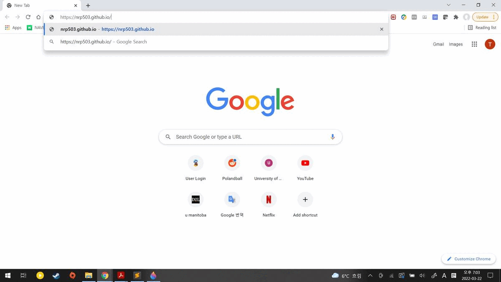

# How to host a resume on GitHub
***
# Topics
***
1. Title
2. Prerequisites
3. Instructions
4. More Resources
5. Authors and Acknowledgments 
6. FAQs
***

# Prerequisites
***
1. Your resume in MarkDown format.
2. Github Account with public repository

***
# Instructions
***

## Part1: Resume

There are several lightweight markup languages in this world but I chose

Markdown because it is the most widely used light weight markup language in the world.

These are the steps for hosting and formating resume using GitHub pages:

1. You need to make GitHub account if you don't have one.

2. Go to the "Repositories"

3. On the textbox named "Repository Name" please type "your_username".github.io.

4. Then click on "Create Repository"

5. When your new repository is ready please change your "Your Resume Name".md into "index.md"

6. In your repository named "YourUserName.github.io" click on "Add file"

7. Then click on "Upload files"

8. Upload your "index.md" file and click the green button named "Commit changes"

9. Then go to your "YourUserName.github.io" page on broswer

10. Check your resume upload is succesful.

## Part2: Resume on static website

For better apperance of resume presentation use static site generator Jekyll.

1. Go to your repository.

2. Click on "Settings" button.

3. 

***
# More Resources
***
[Markdown Tutorial](https://www.markdowntutorial.com/)

[Modern Technical Writing](https://www.amazon.ca/Modern-Technical-Writing-Introduction-Documentation-ebook/dp/B01A2QL9SS)
***
# Authors & Acknowledgements
***
Written by Sungjae Hyun under guidelines of Andrew Etter's book *Modern Technical Writing*.
Also, thanks to my groupmates Chowdhury Ishmam, PokYee Tsu, Kieran Ketelesen, and Zhong He for insights and feedback.
***
# FAQ
***
1. Why is Markdown better than a word processor?

First, Markdown is free to use unlike Microsoft Office products.

Second, Markdown helps user to create simple and static websites.

2. "Why is my resume not showing up?"

GitHub takes some time to update its repository so please return to your repository after some time.
